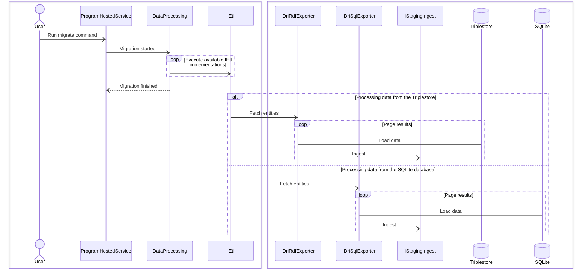

[](https://github.com/nationalarchives/dri-data-migration/actions/workflows/ontology-test.yml)
[](https://github.com/nationalarchives/dri-data-migration/actions/workflows/ci.yml)
[](https://github.com/nationalarchives/dri-data-migration/actions/workflows/publish.yml)

# Staging (interim) data model

Schema visualization at [WebVOWL](https://service.tib.eu/webvowl/#iri=https://raw.githubusercontent.com/nationalarchives/dri-data-migration/refs/heads/main/Ontology.ttl)

# DRI (Digital Records Infrastructure) data migration

Migration CLI provides functionality to run sequential, recoverable, idempotent and observable [ETL process](#data-extraction). It also enables [extracted data reconciliation](#data-reconciliation) and [exporting extracted data to JSON files](#data-export).\
To view available commands and options, run:
```cmd
Migration.exe --help
```

## Prerequisites

Data migration operates on two data sources: SQLite and triplestore. [A new table must be created](https://github.com/nationalarchives/dri-data-migration/blob/main/PostSqliteExport.sql) to optimize query performance.\
Both the target (staging triplestore) and DRI triplestore can be [hosted using Docker](https://github.com/nationalarchives/dri-data-migration/blob/main/compose.yaml).

### Setup

1. Download the DRI triplestore backup.
2. Export a subset of SQL data from to a SQLite database.
3. [Apply script](https://github.com/nationalarchives/dri-data-migration/blob/main/PostSqliteExport.sql).
4. [Start Docker container](https://github.com/nationalarchives/dri-data-migration/blob/main/compose.yaml).
5. Create the `dri` repository.
6. Import backup into the `dri` repository.
7. Set the `dri` repository to `read-only`.
8. [Create the `staging` repository](https://github.com/nationalarchives/dri-data-migration/blob/main/staging.http#L3).
9. [Apply the ontology](https://github.com/nationalarchives/dri-data-migration/blob/main/staging.http#L53).

# Data extraction

Runs the ETL process for a specified series (collection).\
Command: `migrate`



## Examples

All default options:
```cmd
.\Migration.exe migrate --reference "XYZ 123"
```

SQLite file location and page size:
```cmd
.\Migration.exe migrate --reference "XYZ 123" --sql "Data Source=c:/dri.sqlite;Mode=ReadOnly" --page-size 3000
```

Restart from `Sensitivity review` stage at record 100:
```cmd
.\Migration.exe migrate --reference "XYZ 123" --restart-from-stage SensitivityReview --restart-from-offset 100
```

## Sequence

1. Access conditions\
   Ingested data is shared across all series.
   [Data comes from the DRI triplestore](https://github.com/nationalarchives/dri-data-migration/blob/main/Dri/Sparql/GetAccessConditionsAsync.sparql).
2. Legislations\
   Ingested data is shared across all series.
   [Data comes from the DRI triplestore](https://github.com/nationalarchives/dri-data-migration/blob/main/Dri/Sparql/GetLegislationsAsync.sparql).
3. Grounds for retention\
   Ingested data is shared across all series.
   [Data comes from the DRI triplestore](https://github.com/nationalarchives/dri-data-migration/blob/main/Dri/Sparql/GetGroundsForRetentionAsync.sparql).
4. Subsets\
   [Data comes from the DRI triplestore](https://github.com/nationalarchives/dri-data-migration/blob/main/Dri/Sparql/GetSubsetsByCodeAsync.sparql).
5. Assets\
   [Data comes from the DRI triplestore](https://github.com/nationalarchives/dri-data-migration/blob/main/Dri/Sparql/GetAssetsByCodeAsync.sparql).
6. Variations\
   [Data comes from the DRI triplestore](https://github.com/nationalarchives/dri-data-migration/blob/main/Dri/Sparql/GetVariationsByCodeAsync.sparql).
7. Assets (deliverable units)\
   Enhances data ingested in step 5 by parsing XML stored in the SQL database.
   [Data comes from the SQLite](https://github.com/nationalarchives/dri-data-migration/blob/main/Dri/Sql/GetAssetDeliverableUnits.sql).
8. `WO 409` subset (deliverable units)\
   Only applies to `WO 409` series. Enhances data ingested in step 5 and 7 by parsing XML stored in the SQL database.
   [Data comes from the SQLite](https://github.com/nationalarchives/dri-data-migration/blob/main/Dri/Sql/GetWo409SubsetDeliverableUnits.sql).
9. Variations (files)\
   Enhances data ingested in step 6 by parsing XML stored in the SQL database.
   [Data comes from the SQLite](https://github.com/nationalarchives/dri-data-migration/blob/main/Dri/Sql/GetVariationFiles.sql).
10. Sensitivity reviews\
    [Data comes from the DRI triplestore](https://github.com/nationalarchives/dri-data-migration/blob/main/Dri/Sparql/GetSensitivityReviewsByCodeAsync.sparql).
11. Changes\
    [Data comes from the SQLite](https://github.com/nationalarchives/dri-data-migration/blob/main/Dri/Sql/GetChanges.sql).

## Mapping

### Namespaces

- dri: [http://nationalarchives.gov.uk/terms/dri#](https://github.com/digital-preservation/dri-vocabulary/blob/master/terms/dri_vocabulary.ttl)
- ex: [http://id.example.com/schema/](https://github.com/nationalarchives/dri-data-migration/blob/main/Ontology.ttl)
- dcterms: http://purl.org/dc/terms/
- rdfs: http://www.w3.org/2000/01/rdf-schema#
- prov: http://www.w3.org/ns/prov#
- tna: http://nationalarchives.gov.uk/metadata/tna#
- tnas: http://nationalarchives.gov.uk/metadata/spatial/
- tnap: http://nationalarchives.gov.uk/metadata/person/
- trans: http://nationalarchives.gov.uk/dri/transcription
- xip: http://www.tessella.com/XIP/v4

### Access condition

#### Sequence step 1

Source: [query](https://github.com/nationalarchives/dri-data-migration/blob/main/Dri/Sparql/GetAccessConditionsAsync.sparql)\
Target: [graph](https://github.com/nationalarchives/dri-data-migration/blob/main/Staging/Sparql/AccessConditionGraph.sparql)

| Source | Target |
| --- | --- |
| dri:ClosureType (subject's fragment) | ex:accessConditionCode |
| dri:ClosureType (rdfs:label) | ex:accessConditionName |

### Legislation

#### Sequence step 2

Source: [query](https://github.com/nationalarchives/dri-data-migration/blob/main/Dri/Sparql/GetLegislationsAsync.sparql)\
Target: [graph](https://github.com/nationalarchives/dri-data-migration/blob/main/Staging/Sparql/LegislationGraph.sparql)

| Source | Target |
| --- | --- |
| dri:exemptionCode/rdfs:label (object's fragment) | ex:legislationSectionReference |
| dri:exemptionCode | ex:legislationHasUkLegislation |

### Ground for retention

#### Sequence step 3

Source: [query](https://github.com/nationalarchives/dri-data-migration/blob/main/Dri/Sparql/GetGroundsForRetentionAsync.sparql)\
Target: [graph](https://github.com/nationalarchives/dri-data-migration/blob/main/Staging/Sparql/GroundForRetentionGraph.sparql)

| Source | Target |
| --- | --- |
| dri:RetentionJustificationType (rdfs:label) | ex:groundForRetentionCode |
| dri:RetentionJustificationType (rdfs:comment) | ex:groundForRetentionDescription |

### Subset

#### Sequence step 4

Source: [query](https://github.com/nationalarchives/dri-data-migration/blob/main/Dri/Sparql/GetSubsetsByCodeAsync.sparql)\
Target: [graph](https://github.com/nationalarchives/dri-data-migration/blob/main/Staging/Sparql/GetSubset.sparql)

| Source | Target |
| --- | --- |
| dri:DeliverableUnit (rdfs:label) | ex:subsetReference |
| dri:DeliverableUnit (dri:parent/rdfs:label) or dri:DeliverableUnit (dri:hasDirectory/rdfs:label) or series code | ex:subsetHasBroaderSubset/ex:subsetReference |
| dri:DeliverableUnit (dri:hasDirectory/rdfs:label) | ex:subsetHasRetention/ex:importLocation |

### Asset

#### Sequence step 5

Source: [query](https://github.com/nationalarchives/dri-data-migration/blob/main/Dri/Sparql/GetAssetsByCodeAsync.sparql)\
Target: [graph](https://github.com/nationalarchives/dri-data-migration/blob/main/Staging/Sparql/AssetGraph.sparql)

| Source | Target |
| --- | --- |
| dri:DeliverableUnit (subject's last URI segment) | ex:assetDriId |
| dri:DeliverableUnit (rdfs:label) | ex:assetReference |
| dri:DeliverableUnit (dri:parent/rdfs:label) or series code | ex:assetHasSubset/ex:subsetReference |
| dri:DeliverableUnit (dri:parent/dri:hasDirectory/rdfs:label) | ex:assetHasRetention/ex:importLocation |

#### Sequence step 7

Source: [query](https://github.com/nationalarchives/dri-data-migration/blob/main/Dri/Sql/GetAssetDeliverableUnits.sql)\
Target: [graph](https://github.com/nationalarchives/dri-data-migration/blob/main/Staging/Sparql/AssetDeliverableUnitGraph.sparql)

| Source | Target |
| --- | --- |
| _SQLite_ | |
| xmlmetadata.XMLCLOB | ex:assetDriXml |
| _XMLCLOB_ | |
| tna:batchIdentifier | ex:batchDriId |
| tna:tdrConsignmentRef | ex:consignmentTdrId |
| dcterms:description or tna:contentManagementSystemContainer or tna:summary or tna:additionalInformation or tna:itemDescription | ex:assetDescription |
| tna:administrativeBackground | ex:assetSummary |
| tna:relatedMaterial or trans:relatedMaterial | ex:assetRelationDescription |
| tna:relatedIaid | ex:assetRelationIdentifier |
| tna:physicalDescription or trans:physicalFormat | ex:assetPhysicalDescription |
| tna:evidenceProvidedBy | ex:evidenceProviderName |
| tna:investigation | ex:investigationName |
| tna:restrictionOnUse | ex:assetUsageRestrictionDescription |
| tna:formerReferenceTNA or tna:formerReferenceDepartment | ex:assetPastReference |
| tna:classification | ex:assetTag |
| tna:internalDepartment | ex:assetSourceInternalName |
| tna:filmMaker | ex:filmProductionCompanyName |
| tna:filmName | ex:filmTitle |
| tna:photographer | ex:photographerDescription |
| trans:paperNumber | ex:paperNumber |
| trans:sealOwner | ex:sealOwnerName |
| trans:colourOfOriginalSeal | ex:sealColour |
| trans:separatedMaterial | ex:assetConnectedAssetNote |
| tna:attachmentFormerReference | ex:emailAttachmentReference |
| tna:session_date | ex:courtSessionDate |
| tna:hearing_date | ex:inquiryHearingDate |
| trans:startImageNumber | ex:imageSequenceStart |
| trans:endImageNumber | ex:imageSequenceEnd |
| dcterms:title | ex:assetName or ex:assetAlternativeName |
| tna:hasRedactedFile | ex:assetHasVariation and ex:redactedVariationSequence |
| tna:durationMins | ex:filmDuration |
| tna:webArchiveUrl | ex:assetHasUkGovernmentWebArchive |
| tna:case_id_{Sequence} | ex:courtAssetHasCourtCase/ex:courtCaseReference |
| tna:case_name_{Sequence} | ex:courtAssetHasCourtCase/ex:courtCaseName |
| tna:case_summary_{Sequence} | ex:courtAssetHasCourtCase/ex:courtCaseSummary |
| tna:case_summary_{Sequence}_judgment | ex:courtAssetHasCourtCase/ex:courtCaseSummaryJudgment |
| tna:case_summary_{Sequence}_reasons_for_judgment | ex:courtAssetHasCourtCase/ex:courtCaseSummaryReasonsForJudgment |
| tna:hearing_start_date_{Sequence} | ex:courtAssetHasCourtCase/ex:courtCaseHearingStartDate |
| tna:hearing_end_date_{Sequence} | ex:courtAssetHasCourtCase/ex:courtCaseHearingEndDate |
| tna:witness_list_{Sequence} | ex:inquiryAssetHasInquiryAppearance/ex:inquiryWitnessName |
| tna:subject_role_{Sequence} | ex:inquiryAssetHasInquiryAppearance/ex:inquiryWitnessAppearanceDescription |
| tna:session | ex:inquirySessionDescription |
| xip:CoverageFrom or dcterms:coverage/tna:startDate or dcterms:coverage/tna:fullDate or dcterms:coverage/tna:dateRange | ex:assetHasOriginDateStart or ex:assetHasOriginApproximateDateStart |
| xip:CoverageTo or dcterms:coverage/tna:endDate or dcterms:coverage/tna:fullDate or dcterms:coverage/tna:dateRange | ex:assetHasOriginDateEnd or ex:assetHasOriginApproximateDateEnd |
| dcterms:language | ex:assetHasLanguage/ex:languageName |
| trans:counties or tnas:county | ex:assetHasAssociatedGeographicalPlace/ex:geographicalPlaceName |
| tna:heldBy | ex:assetHasRetention/ex:retentionHasFormalBody/ex:formalBodyName |
| dcterms:creator | ex:assetHasCreation/ex:creationHasFormalBody/ex:formalBodyName |
| dcterms:rights | ex:assetHasCopyright/ex:copyrightTitle |
| tna:legalStatus | ex:assetHasLegalStatus |
| trans:typeOfSeal | ex:sealAssetHasSealCategory/ex:sealCategoryName |
| trans:dateOfOriginalSeal | ex:sealAssetHasStartDate or ex:sealAssetHasObverseStartDate or ex:sealAssetHasReverseStartDate or ex:sealAssetHasEndDate or ex:sealAssetHasObverseEndDate or ex:sealAssetHasReverseEndDate |
| trans:dimensions | ex:assetHasDimension or ex:sealAssetHasObverseDimension or ex:sealAssetHasReverseDimension or {any of the previous}/(ex:firstDimensionMillimetre\|ex:secondDimensionMillimetre) |

#### Sequence step 8

Source: [query](https://github.com/nationalarchives/dri-data-migration/blob/main/Dri/Sql/GetWo409SubsetDeliverableUnits.sql)\
Target: [graph](https://github.com/nationalarchives/dri-data-migration/blob/main/Staging/Sparql/Wo409SubsetDeliverableUnitGraph.sparql)

| Source | Target |
| --- | --- |
| _SQLite_ | |
| xmlmetadata.XMLCLOB | ex:wo409SubsetDriXml |
| _XMLCLOB_ | |
| tnap:namePart | (ex:assetHasVeteran\|ex:assetHasPerson)/ex:personFullName or (ex:assetHasVeteran\|ex:assetHasPerson)/ex:personGivenName or (ex:assetHasVeteran\|ex:assetHasPerson)/ex:personFamilyName |
| tnap:nationalRegistrationNumber | (ex:assetHasVeteran\|ex:assetHasPerson)/ex:nationalRegistrationNumber |
| dcterms:subject/tnas:address/tnas:addressString | (ex:assetHasVeteran\|ex:assetHasPerson)/ex:personHasContactPoint/ex:geographicalPlaceName |
| dcterms:subject/tnap:birth/tnap:date | (ex:assetHasVeteran\|ex:assetHasPerson)/ex:personDateOfBirth |
| dcterms:subject/tnas:birth/tnas:addressString | (ex:assetHasVeteran\|ex:assetHasPerson)/ex:personHasBirthAddress/ex:geographicalPlaceName |
| tnas:county and dcterms:references | (ex:assetHasVeteran\|ex:assetHasPerson)/ex:personHasBattalionMembership/ex:battalionMembershipHasBattalion/ex:battalionName |
| tnap:relation/tnap:person/tnap:name/tnap:nameString | (ex:assetHasVeteran\|ex:assetHasPerson)/ex:personHasNextOfKinRelationship/ex:nextOfKinRelationshipHasNextOfKin/ex:personFullName |
| tnap:relation (malformed RDF) | (ex:assetHasVeteran\|ex:assetHasPerson)/ex:personHasNextOfKinRelationship/ex:nextOfKinRelationshipHasKinship |

### Variation

#### Sequence step 6

Source: [query](https://github.com/nationalarchives/dri-data-migration/blob/main/Dri/Sparql/GetVariationsByCodeAsync.sparql)\
Target: [graph](https://github.com/nationalarchives/dri-data-migration/blob/main/Staging/Sparql/VariationGraph.sparql)

| Source | Target |
| --- | --- |
| dri:File (subject's last URI segment) | ex:variationDriId |
| dri:File (rdfs:label) | ex:variationName |
| dri:File (^dri:file/dri:parent/rdfs:label) | ex:variationHasAsset/ex:assetReference |

#### Sequence step 9

Source: [query](https://github.com/nationalarchives/dri-data-migration/blob/main/Dri/Sql/GetVariationFiles.sql)\
Target: [graph](https://github.com/nationalarchives/dri-data-migration/blob/main/Staging/Sparql/VariationFileGraph.sparql)

| Source | Target |
| --- | --- |
| _SQLite_ | |
| digitalfile.FILELOCATION + '/' + digitalfile.NAME | ex:variationRelativeLocation |
| deliverableunitmanifestation.MANIFESTATIONREF | ex:variationDriManifestationId |
| xmlmetadata.XMLCLOB | ex:variationDriXml |
| _XMLCLOB_ | |
| rdfs:comment or tna:note | ex:variationNote |
| tna:physicalCondition | ex:variationPhysicalConditionDescription |
| tna:googleId | ex:variationReferenceGoogleId |
| tna:googleParentId | ex:variationReferenceParentGoogleId |
| tna:scanId | ex:scannerIdentifier |
| tna:scanOperator | ex:scannerOperatorIdentifier |
| tna:ordinal | ex:variationSequence |
| tna:scanLocation | ex:scannedVariationHasScannerGeographicalPlace/ex:geographicalPlaceName |
| tna:imageSplit | ex:scannedVariationHasImageSplit |
| tna:imageCrop | ex:scannedVariationHasImageCrop |
| tna:imageDeskew | ex:scannedVariationHasImageDeskew |
| tna:archivistNote/tna:archivistNoteInfo | ex:variationHasDatedNote/ex:archivistNote |
| tna:archivistNote/tna:archivistNoteDate | ex:variationHasDatedNote/ex:datedNoteHasDate |


### Sensitivity review

#### Sequence step 10

Source: [query](https://github.com/nationalarchives/dri-data-migration/blob/main/Dri/Sparql/GetSensitivityReviewsByCodeAsync.sparql)\
Target: [graph](https://github.com/nationalarchives/dri-data-migration/blob/main/Staging/Sparql/SensitivityReviewGraph.sparql)

| Source | Target |
| --- | --- |
| prov:specializationOf (subject's last URI segment) | ex:sensitivityReviewDriId |
| prov:specializationOf/rdfs:label | ex:sensitivityReviewHasSubset/ex:subsetReference or ex:SensitivityReviewHasAsset/ex:assetReference |
| prov:specializationOf (object's last URI segment) | ex:sensitivityReviewHasVariation/ex:variationDriId |
| dri:closureType | ex:sensitivityReviewHasAccessCondition/ex:accessConditionCode |
| dri:exemptionAsserted | ex:sensitivityReviewDate |
| dri:titleAlternative | ex:sensitivityReviewSensitiveName |
| dcterms:alternative | ex:sensitivityReviewSensitiveDescription |
| prov:wasRevisionOf | ex:sensitivityReviewHasPastSensitivityReview |
| dri:reviewDate | ex:sensitivityReviewHasSensitivityReviewRestriction/ex:sensitivityReviewRestrictionReviewDate |
| dri:startDate | ex:sensitivityReviewHasSensitivityReviewRestriction/ex:sensitivityReviewRestrictionCalculationStartDate |
| dri:closurePeriod | ex:sensitivityReviewHasSensitivityReviewRestriction/ex:sensitivityReviewRestrictionDuration or ex:sensitivityReviewHasSensitivityReviewRestriction/ex:sensitivityReviewRestrictionEndYear |
| prov:qualifiedInfluence/prov:influencer/rdfs:label | ex:sensitivityReviewHasSensitivityReviewRestriction/ex:sensitivityReviewRestrictionDescription |
| dr:exemptionCode | ex:sensitivityReviewHasSensitivityReviewRestriction/ex:sensitivityReviewRestrictionHasLegislation/ex:legislationHasUkLegislation |
| dri:rINumber | ex:sensitivityReviewHasSensitivityReviewRestriction/ex:sensitivityReviewRestrictionHasRetentionRestriction/ex:retentionInstrumentNumber |
| dri:retentionReconsiderDate | ex:sensitivityReviewHasSensitivityReviewRestriction/ex:sensitivityReviewRestrictionHasRetentionRestriction/ex:retentionInstrumentSignatureDate |
| dri:rISignedDate | ex:sensitivityReviewHasSensitivityReviewRestriction/ex:sensitivityReviewRestrictionHasRetentionRestriction/ex:retentionRestrictionReviewDate  |
| dri:retentionJustification | ex:sensitivityReviewHasSensitivityReviewRestriction/ex:sensitivityReviewRestrictionHasRetentionRestriction/ex:retentionRestrictionHasGroundForRetention/ex:groundForRetentionCode |
| prov:qualifiedGeneration (object's last URI segment) | ex:sensitivityReviewHasChange/ex:changeDriId |
| prov:qualifiedGeneration/prov:activity/rdfs:label | ex:sensitivityReviewHasChange/ex:changeDescription |
| prov:qualifiedGeneration/prov:atTime | ex:sensitivityReviewHasChange/ex:changeDateTime |
| prov:qualifiedGeneration/prov:wasAssociatedWith/rdfs:label | ex:sensitivityReviewHasChange/ex:changeHasOperator/ex:operatorName |

### Change

#### Sequence step 11

Source: [query](https://github.com/nationalarchives/dri-data-migration/blob/main/Dri/Sql/GetChanges.sql)\
Target: [graph](https://github.com/nationalarchives/dri-data-migration/blob/main/Staging/Sparql/ChangeGraph.sparql)

| Source | Target |
| --- | --- |
| auditchange.CHANGEREF | ex:changeDriId |
| auditchange.XMLDIFF | ex:changeDescription |
| auditchange.DATETIME | ex:changeDateTime |
| tableinvolved.TABLENAME and auditchange.PRIMARYKEYVALUE | ex:changeHasAsset or ex:changeHasVariation |
| auditchange.USERNAME | ex:changeHasOperator/ex:operatorIdentifier |
| auditchange.FULLNAME | ex:changeHasOperator/ex:operatorName |

# Data reconciliation

Command: `reconcile`.

# Data export

Command: `export`.
