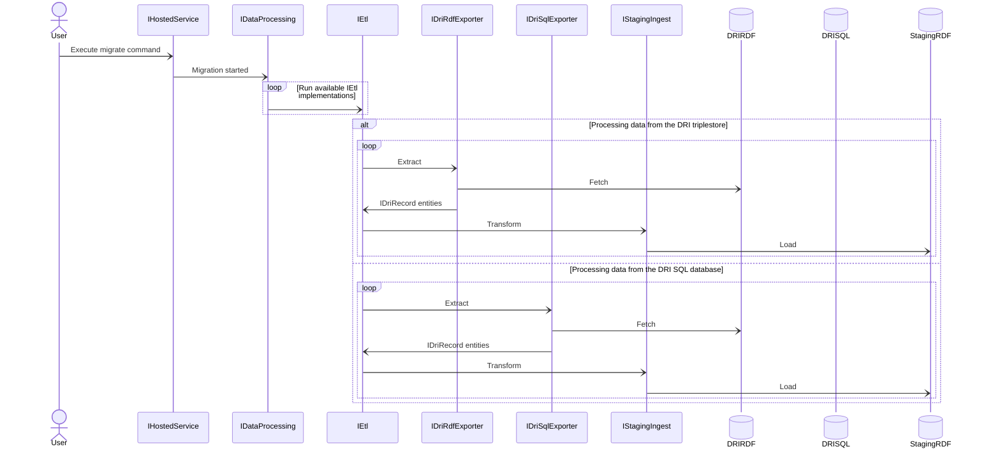

# DRI (Digital Records Infrastructure) data migration

- [Diagram](#diagram)
- [Examples](#examples)
- [Migration sequence](#migration-sequence)
- [Mapping](etl-mapping.md)

Migration CLI provides functionality to run sequential, recoverable, idempotent and observable ETL process.\
Command: `migrate`

## Diagram



## Examples

All default options:
```cmd
.\Migration.exe migrate --reference "XYZ 123"
```

SQLite file location and page size:
```cmd
.\Migration.exe migrate --reference "XYZ 123" --sql "Data Source=c:/dri.sqlite;Mode=ReadOnly" --page-size 3000
```

Restart from `Sensitivity review` stage at record 100:
```cmd
.\Migration.exe migrate --reference "XYZ 123" --restart-from-stage SensitivityReview --restart-from-offset 100
```

## Migration sequence

1. Access conditions\
   Ingested data is shared across all series.
   [Data comes from the DRI triplestore](https://github.com/nationalarchives/dri-data-migration/blob/main/Dri/Sparql/GetAccessConditionsAsync.sparql).
2. Legislations\
   Ingested data is shared across all series.
   [Data comes from the DRI triplestore](https://github.com/nationalarchives/dri-data-migration/blob/main/Dri/Sparql/GetLegislationsAsync.sparql).
3. Grounds for retention\
   Ingested data is shared across all series.
   [Data comes from the DRI triplestore](https://github.com/nationalarchives/dri-data-migration/blob/main/Dri/Sparql/GetGroundsForRetentionAsync.sparql).
4. Subsets\
   [Data comes from the DRI triplestore](https://github.com/nationalarchives/dri-data-migration/blob/main/Dri/Sparql/GetSubsetsByCodeAsync.sparql).
5. Assets\
   [Data comes from the DRI triplestore](https://github.com/nationalarchives/dri-data-migration/blob/main/Dri/Sparql/GetAssetsByCodeAsync.sparql).
6. Variations\
   [Data comes from the DRI triplestore](https://github.com/nationalarchives/dri-data-migration/blob/main/Dri/Sparql/GetVariationsByCodeAsync.sparql).
7. Assets (deliverable units)\
   Enhances data ingested in step 5 by parsing XML stored in the SQL database.
   [Data comes from the SQLite](https://github.com/nationalarchives/dri-data-migration/blob/main/Dri/Sql/GetAssetDeliverableUnits.sql).
8. `WO 409` subset (deliverable units)\
   Only applies to `WO 409` series. Enhances data ingested in step 5 and 7 by parsing XML stored in the SQL database.
   [Data comes from the SQLite](https://github.com/nationalarchives/dri-data-migration/blob/main/Dri/Sql/GetWo409SubsetDeliverableUnits.sql).
9. Variations (files)\
   Enhances data ingested in step 6 by parsing XML stored in the SQL database.
   [Data comes from the SQLite](https://github.com/nationalarchives/dri-data-migration/blob/main/Dri/Sql/GetVariationFiles.sql).
10. Sensitivity reviews\
    [Data comes from the DRI triplestore](https://github.com/nationalarchives/dri-data-migration/blob/main/Dri/Sparql/GetSensitivityReviewsByCodeAsync.sparql).
11. Changes\
    [Data comes from the SQLite](https://github.com/nationalarchives/dri-data-migration/blob/main/Dri/Sql/GetChanges.sql).
