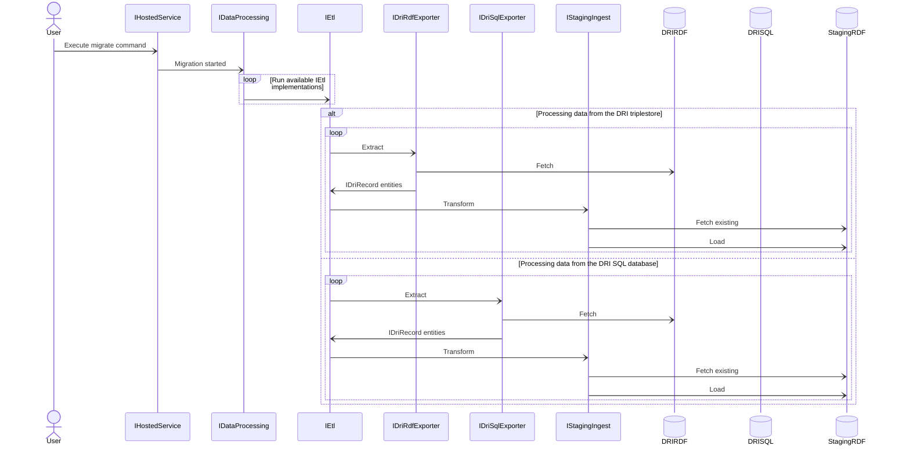

# DRI (Digital Records Infrastructure) data migration

- [Diagram](#diagram)
- [Examples](#examples)
- [Migration sequence](#migration-sequence)
- [Mapping](etl-mapping.md)

Migration CLI provides functionality to run sequential, recoverable, idempotent and observable ETL process.\
Command: `migrate`

## Diagram



## Examples

All default options:
```cmd
.\Migration.exe migrate --reference "XYZ 123"
```

SQLite file location and page size:
```cmd
.\Migration.exe migrate --reference "XYZ 123" --sql "Data Source=c:/dri.sqlite;Mode=ReadOnly" --page-size 3000
```

Restart from `Sensitivity review` stage at record 100:
```cmd
.\Migration.exe migrate --reference "XYZ 123" --restart-from-stage SensitivityReview --restart-from-offset 100
```

Debug with `Migration/Properties/launchSettings.json`
```json
{
    "profiles": {
        "migration": {
            "commandName": "Project",
            "commandLineArgs": "migrate --reference \"XYZ 123\""
        }
    }
}
```

## Migration sequence

1. [Access conditions](https://github.com/nationalarchives/dri-data-migration/blob/main/docs/etl-mapping.md#sequence-step-1)\
   Ingested data is shared across all series.
   [Data comes from the DRI triplestore](https://github.com/nationalarchives/dri-data-migration/blob/main/Dri/Sparql/GetAccessConditionsAsync.sparql).
2. [Legislations](https://github.com/nationalarchives/dri-data-migration/blob/main/docs/etl-mapping.md#sequence-step-2)\
   Ingested data is shared across all series.
   [Data comes from the DRI triplestore](https://github.com/nationalarchives/dri-data-migration/blob/main/Dri/Sparql/GetLegislationsAsync.sparql).
3. [Grounds for retention](https://github.com/nationalarchives/dri-data-migration/blob/main/docs/etl-mapping.md#sequence-step-3)\
   Ingested data is shared across all series.
   [Data comes from the DRI triplestore](https://github.com/nationalarchives/dri-data-migration/blob/main/Dri/Sparql/GetGroundsForRetentionAsync.sparql).
4. [Subsets](https://github.com/nationalarchives/dri-data-migration/blob/main/docs/etl-mapping.md#sequence-step-4)\
   [Data comes from the DRI triplestore](https://github.com/nationalarchives/dri-data-migration/blob/main/Dri/Sparql/GetSubsetsByCodeAsync.sparql).
5. [`ADM 158` subset (deliverable units)](https://github.com/nationalarchives/dri-data-migration/blob/main/docs/etl-mapping.md#sequence-step-5)\
   Only applies to `ADM 158` series. Enhances data ingested in step 4 by parsing XML stored in the SQL database.
   [Data comes from the SQLite](https://github.com/nationalarchives/dri-data-migration/blob/main/Dri/Sql/GetAdm158SubsetDeliverableUnit.sql).
6. [Assets](https://github.com/nationalarchives/dri-data-migration/blob/main/docs/etl-mapping.md#sequence-step-6)\
   [Data comes from the DRI triplestore](https://github.com/nationalarchives/dri-data-migration/blob/main/Dri/Sparql/GetAssetsByCodeAsync.sparql).
7. [Variations](https://github.com/nationalarchives/dri-data-migration/blob/main/docs/etl-mapping.md#sequence-step-7)\
   [Data comes from the DRI triplestore](https://github.com/nationalarchives/dri-data-migration/blob/main/Dri/Sparql/GetVariationsByCodeAsync.sparql).
8. [Assets (deliverable units)](https://github.com/nationalarchives/dri-data-migration/blob/main/docs/etl-mapping.md#sequence-step-8)\
   Enhances data ingested in step 6 by parsing XML stored in the SQL database.
   [Data comes from the SQLite](https://github.com/nationalarchives/dri-data-migration/blob/main/Dri/Sql/GetAssetDeliverableUnits.sql).
9. [`WO 409` subset (deliverable units)](https://github.com/nationalarchives/dri-data-migration/blob/main/docs/etl-mapping.md#sequence-step-9)\
   Only applies to `WO 409` series. Enhances data ingested in step 6 and 8 by parsing XML stored in the SQL database.
   [Data comes from the SQLite](https://github.com/nationalarchives/dri-data-migration/blob/main/Dri/Sql/GetWo409SubsetDeliverableUnits.sql).
10. [Variations (files)](https://github.com/nationalarchives/dri-data-migration/blob/main/docs/etl-mapping.md#sequence-step-10)\
   Enhances data ingested in step 7 by parsing XML stored in the SQL database.
   [Data comes from the SQLite](https://github.com/nationalarchives/dri-data-migration/blob/main/Dri/Sql/GetVariationFiles.sql).
11. [Sensitivity reviews](https://github.com/nationalarchives/dri-data-migration/blob/main/docs/etl-mapping.md#sequence-step-11)\
    [Data comes from the DRI triplestore](https://github.com/nationalarchives/dri-data-migration/blob/main/Dri/Sparql/GetSensitivityReviewsByCodeAsync.sparql).
12. [Changes](https://github.com/nationalarchives/dri-data-migration/blob/main/docs/etl-mapping.md#sequence-step-12)\
    [Data comes from the SQLite](https://github.com/nationalarchives/dri-data-migration/blob/main/Dri/Sql/GetChanges.sql).
