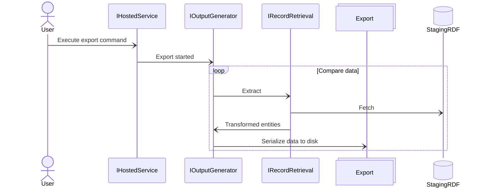

# Data export

- [Diagram](#diagram)
- [Examples](#examples)
- [Mapping](export-mapping.md)

Runs process to generate JSON and/or XML files from the extracted and transformed data (staging database). If data is exported into JSON files, then it is split into groups by variation within the asset: redacted and unredacted. Assumption is made that all values across grouped unredacted variations are identical.\
Command: `export`

## Diagram



## Examples

Export with default options:
```cmd
.\Migration.exe export --reference "XYZ 123"
```

Export to JSON and XML files:
```cmd
.\Migration.exe export --reference "XYZ 123  --export-scope JSONAndXML"
```

Custom page size and restart at record 500:
```cmd
.\Migration.exe export --reference "XYZ 123" --page-size 100 --restart-from-offset 500
```
