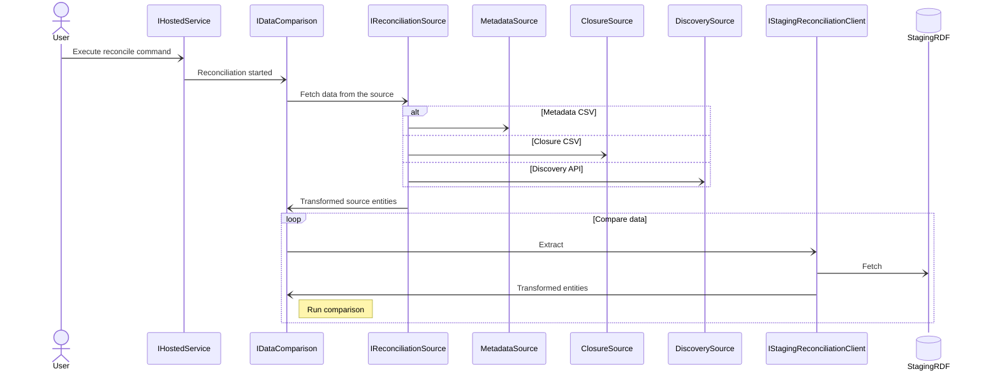

# Data reconciliation

- [Diagram](#diagram)
- [Examples](#examples)
- [Mapping](reconciliation-mapping.md)

Runs the reconciliation process over the extracted and transformed data (staging database). It compares data against three different types of sources:
- metadata CSV file
- closure CSV file
- Discover API

Command: `reconcile`

## Diagram



## Examples

Metadata CSV file:
```cmd
.\Migration.exe reconcile --reference "XYZ 123" --mapping Metadata --reconciliation-file "c:\XYZ\metadata.csv"
```

Multiple closure CSV files:
```cmd
.\Migration.exe reconcile --reference "XYZ 123" --mapping Closure --reconciliation-file "c:\XYZ\1\closure.csv" --reconciliation-file "c:\XYZ\2\closure.csv"
```

Discovery API (default URI and custom page size):
```cmd
.\Migration.exe reconcile --reference "XYZ 123" --mapping Discovery --page-size 2000
```

Debug with `Migration/Properties/launchSettings.json`
```json
{
    "profiles": {
        "reconciliation": {
            "commandName": "Project",
            "commandLineArgs": "reconcile --reference \"XYZ 123\" --mapping Metadata --reconciliation-file \"c:\\XYZ_123\""
        }
    }
}
```
